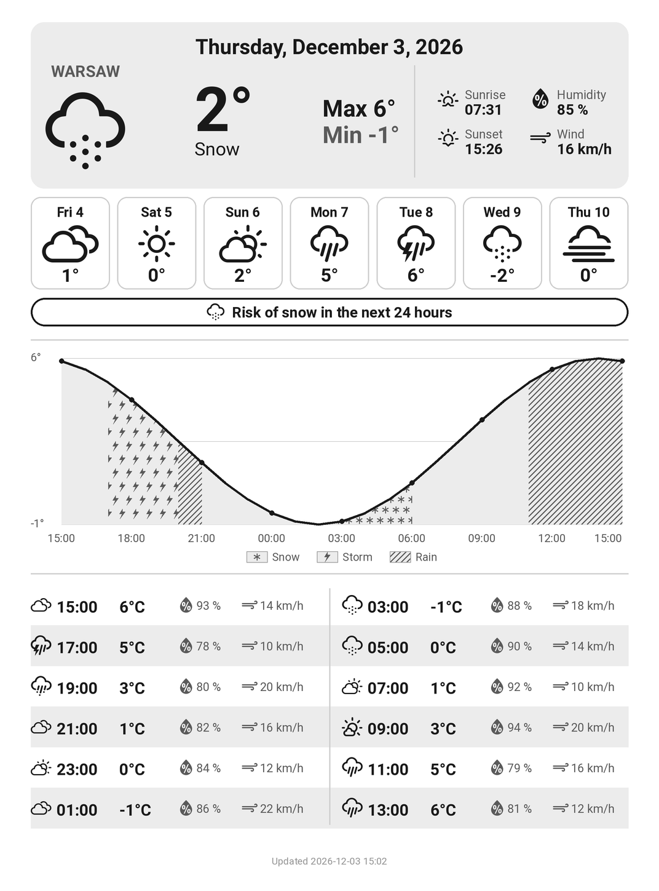
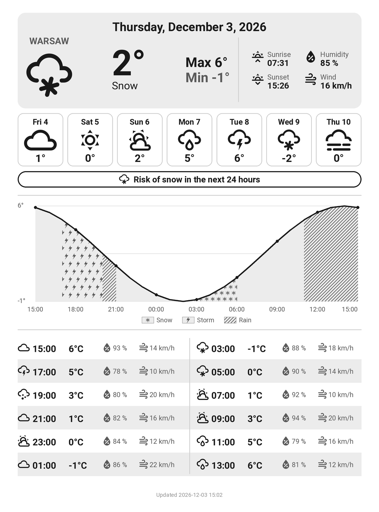

# KindleWeather

[](https://github.com/Marflus/KindleWeather/actions/workflows/ci.yml)

Turn a jailbroken Kindle into a battery-powered weather station. GitHub Actions
renders a grayscale dashboard tuned for e-ink from [Open-Meteo](https://open-meteo.com/)
data every hour. The Kindle downloads it, displays it, and sleeps until the
next refresh.

<p align="center">
  
  
</p>
<p align="center"><sub>Portrait and landscape layouts, rendered from sample data.</sub></p>

## Features

- Today's conditions, min/max, sunrise and sunset, average humidity and wind
- Forecast for the next 7 days: weather icon and mean temperature
- Precipitation alert for the next 24 hours with its icon, by priority: snow, then thunderstorm, then rain
- Temperature chart and 2-hourly table for the next 24 hours, starting at the current hour; rain, thunderstorm and snow hours get distinct patterns
- Portrait or landscape layout, Celsius or Fahrenheit
- Three icon sets to choose from (see [Icon sets](#icon-sets))
- Display in 8 languages (see [Languages](#languages))
- Error screen and error codes when the weather data or the connection is missing
- City set by name; its coordinates and localized name come from the Open-Meteo geocoding API
- Hourly refresh, with the Kindle suspended to RAM in between

## How it works

```
GitHub Actions, every hour                 Kindle, weather station loop
 kindle-weather render                      1. Wi-Fi on, download dashboard.png
   Open-Meteo -> dashboard.png  -------->   2. Wi-Fi off, display it (eips)
 publish to GitHub Pages                    3. suspend to RAM, wake up 1 hour later
```

The station is a KUAL extension. When started, it stops Amazon's interface and
background services, so nothing covers the dashboard and the battery lasts.
Between refreshes the Kindle is suspended to RAM and woken up by its real-time
clock; the e-ink screen keeps the image without power. To get the normal
Kindle back, restart it. The approach comes from
[kindle-weatherstation](https://github.com/mattzzw/kindle-weatherstation).

## Compatibility

You need a **jailbroken** Kindle with **KUAL** and Wi-Fi. Whether a jailbreak
exists depends on your firmware version: see [Kindle Modding](https://kindlemodding.org/)
and the [MobileRead Kindle Developer's Corner](https://www.mobileread.com/forums/forumdisplay.php?f=150).

| Model | Screen | Notes |
|---|---|---|
| Kindle Paperwhite 3 (7th gen, 2015) | 1072×1448 | Main target |
| Kindle Paperwhite 2 (6th gen, 2013) | 758×1024 | Set `display` in the config |
| Kindle Voyage (2014), Oasis (2016), Paperwhite 4 (2018), Kindle (2022) | 1072×1448 | Same resolution |
| Kindle Paperwhite 5 (2021) | 1236×1648 | Set `display` in the config |
| Kindle Oasis 2 and 3 (2017, 2019) | 1264×1680 | Set `display` in the config |

The layouts are designed for a 1072×1448 screen and scaled to the configured
size. The station expects the wake-up clock at `/dev/rtc1`, as on the
Paperwhite 2 and 3; on other models, check `RTC` in
[`station.sh`](kindle/extension/bin/station.sh).

## Installation

### 1. Publish the dashboard

1. Fork this repository and edit [`config/config.json`](config/config.json)
   (see below). Set `dashboard_url` to your GitHub Pages address:
   `https://<user>.github.io/<repository>/dashboard.png`.
2. In **Settings > Pages**, set **Source** to **GitHub Actions**. GitHub Pages
   requires a public repository on the free plan.
3. Run **Actions > Publish dashboard > Run workflow**, then open `dashboard_url`
   in a browser to check the image. The workflow then runs every hour.

### 2. Install the station on the Kindle

Python 3.10 or newer is required.

```bash
git clone https://github.com/<user>/KindleWeather.git
cd KindleWeather
pip install .
```

Plug the Kindle in over USB, then install the KUAL extension on its drive:

```bash
kindle-weather install E:/                  # Windows
kindle-weather install /media/you/Kindle    # Linux
```

Eject the Kindle and restart it so KUAL picks up the new extension.

### 3. Start the station

Open **KUAL > KindleWeather > Start weather station**. The interface
disappears and the dashboard shows up within a minute. A log is kept in
`extensions/kindleweather/station.log` on the Kindle drive.

To stop the station, hold the power button until the Kindle restarts (10 to
20 seconds).

## Configuration

```json
{
  "language": "en",
  "location": { "city": "Lyon", "country_code": "FR" },
  "display": { "width": 1072, "height": 1448, "orientation": "portrait", "icons": "classic" },
  "temperature_unit": "celsius",
  "dashboard_url": "https://you.github.io/KindleWeather/dashboard.png"
}
```

| Key | Description |
|---|---|
| `language` | Display language, see [Languages](#languages). Applies to the dashboard, the city name and the KUAL menu. |
| `location.city` | City name, geocoded by Open-Meteo. The name shown is fetched in the chosen language. |
| `location.country_code` | Optional ISO 3166-1 alpha-2 code (`"FR"`, `"US"`...) to pick the right city among homonyms. |
| `display.width`, `display.height` | Screen resolution in pixels, in portrait (see [Compatibility](#compatibility)). |
| `display.orientation` | `"portrait"` (default) or `"landscape"`. In landscape, read the Kindle turned a quarter turn clockwise. |
| `display.icons` | `"classic"` (default), `"weather-icons"` or `"material"`, see [Icon sets](#icon-sets). |
| `temperature_unit` | `"celsius"` (default) or `"fahrenheit"`. |
| `dashboard_url` | Where the Kindle downloads the dashboard. Any HTTP(S) host works, not only GitHub Pages. |

After changing `language` or `dashboard_url`, run `kindle-weather install`
again. The other settings only need a commit: the next hourly run picks them up.

## Languages

The display is available in English (`en`), French (`fr`), German (`de`),
Spanish (`es`), Italian (`it`), Portuguese (`pt`, Brazilian), Dutch (`nl`) and
Polish (`pl`). Each language is a JSON file in
[`src/kindle_weather/locales`](src/kindle_weather/locales): to add one, copy
`en.json`, translate the values and name the file after the language code.

## Icon sets

Set `display.icons` to pick the icons. Previews of each set, in portrait and
landscape, are in [`preview/`](preview).

| `classic` | `weather-icons` | `material` |
|---|---|---|
|  |  |  |
| Filled shapes drawn by the renderer, with shades of gray. | Outline icons from [Weather Icons](https://erikflowers.github.io/weather-icons/). | Rounded icons from [Material Design Icons](https://pictogrammers.com/library/mdi/). |

The icon fonts are vendored in
[`src/kindle_weather/icon_fonts`](src/kindle_weather/icon_fonts) with their
licenses. To add a set, map the WMO weather codes and the four detail icons to
glyphs in [`icons.py`](src/kindle_weather/icons.py).

## Error codes

| Code | Shown | Meaning |
|---|---|---|
| E1 | Full screen | The weather data could not be fetched or read when the dashboard was rendered. The workflow publishes this screen and fails, so GitHub notifies you. |
| E2 | Top of the last dashboard | The Kindle could not connect to Wi-Fi. |
| E3 | Top of the last dashboard | The Kindle could not download the dashboard. The reason is in `station.log`. |

Every code is retried at the next hourly refresh.

## Usage

```bash
kindle-weather render [--output dashboard.png]   # render the dashboard locally
kindle-weather install MOUNT_PATH                # install the KUAL extension
```

## Project structure

```
.github/workflows/    ci.yml (lint, tests), publish.yml (hourly dashboard)
config/               config.json, the only file to edit
preview/              dashboard previews, portrait and landscape, one folder per icon set
kindle/extension/     KUAL extension; bin/station.sh is the weather station loop
src/kindle_weather/   Python package: config, weather, i18n (locales/*.json), graphics,
                      icons (icon_fonts/*.ttf), render, install
tests/                pytest suite, runs offline
```

## Development

```bash
pip install -e ".[dev]"
pytest
ruff check . && ruff format --check .
shellcheck --shell=sh --severity=warning kindle/extension/bin/*.sh
```

CI runs these checks on every push and pull request.

## Known limitations

- While the station runs, the Kindle cannot be used as an e-reader.
- GitHub may delay scheduled workflows, so the dashboard can be older than an
  hour. GitHub also disables scheduled workflows after 60 days without
  activity in the repository; re-enable it from the **Actions** tab.
- If the Kindle does not wake up by itself, press the power button: the
  station refreshes, then goes back to sleep. Check `RTC` in `station.sh`
  for your model.

## Credits

- The weather station loop (stopping the Kindle interface, waking up with the
  real-time clock, suspending to RAM) is adapted from
  [kindle-weatherstation](https://github.com/mattzzw/kindle-weatherstation) by
  [mattzzw](https://github.com/mattzzw), itself based on
  [Matthew Petroff's Kindle weather display](https://mpetroff.net/2012/09/kindle-weather-display/)
  and [kindle-kt3_weatherdisplay_battery-optimized](https://github.com/nicoh88/kindle-kt3_weatherdisplay_battery-optimized)
  by nicoh88.
- Weather data by [Open-Meteo](https://open-meteo.com/), under CC BY 4.0.
- [Roboto](https://github.com/googlefonts/roboto) font, packaged for Python by
  [Pimoroni](https://github.com/pimoroni/fonts-python).
- [Weather Icons](https://github.com/erikflowers/weather-icons) by Erik
  Flowers, under the SIL Open Font License 1.1.
- [Material Design Icons](https://github.com/Templarian/MaterialDesign) by
  Pictogrammers, under the Apache License 2.0 (weather glyphs only).
- [KUAL](https://www.mobileread.com/forums/showthread.php?t=203326) and the
  MobileRead community for the Kindle jailbreak tooling.

