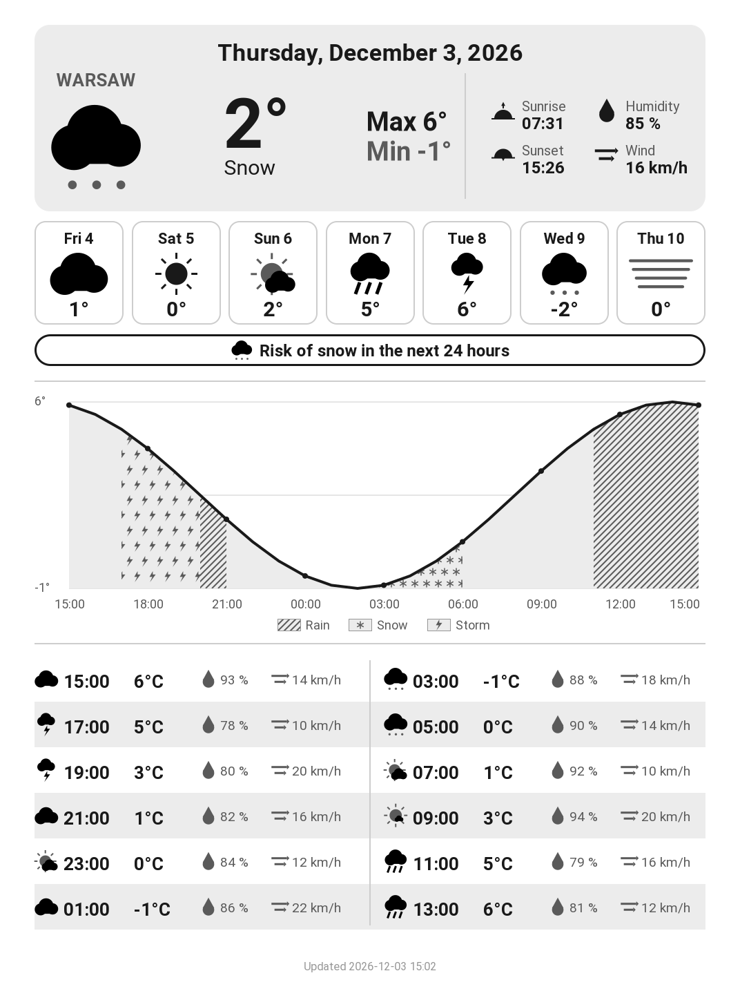
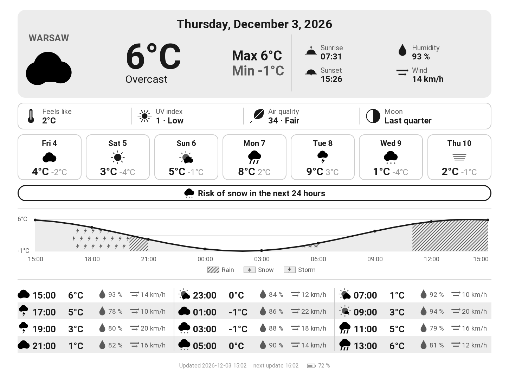
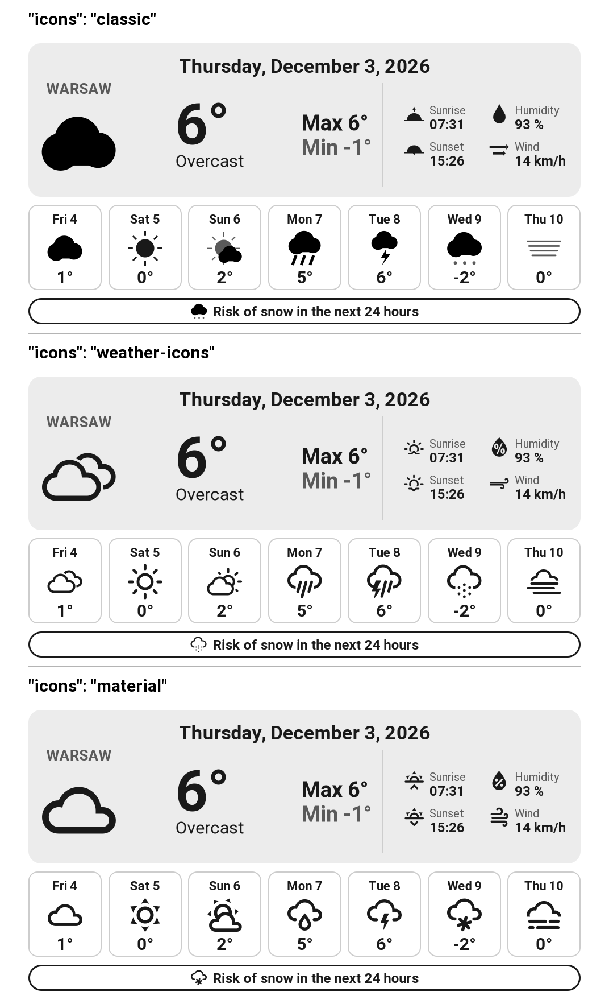

# KindleWeather

Turn a jailbroken Kindle into a standalone, battery-powered weather station.
Every hour the Kindle wakes up, fetches the forecast from
[Open-Meteo](https://open-meteo.com/), draws a grayscale dashboard tuned for
e-ink, displays it and goes back to sleep. No computer, server or account is
needed once it is installed.

<p align="center">
  
  
</p>
<p align="center"><sub>Portrait and landscape layouts, rendered from sample data.</sub></p>

## Features

- Today's conditions, min/max, sunrise and sunset, average humidity and wind
- Forecast for the next 7 days: weather icon and mean temperature
- Precipitation alert for the next 24 hours with its icon, by priority: snow, then thunderstorm, then rain
- Temperature chart and 2-hourly table for the next 24 hours, starting at the current hour; rain, thunderstorm and snow hours get distinct patterns
- Portrait or landscape layout, Celsius or Fahrenheit
- Three icon sets to choose from (see [Icon sets](#icon-sets))
- Display in 8 languages (see [Languages](#languages))
- Error codes for each failure: weather service, location, configuration, Wi-Fi; low battery warning
- City set by name; its coordinates and localized name come from the Open-Meteo geocoding API
- Hourly refresh, with the Kindle suspended to RAM in between; no API key needed

## How it works

```
Kindle, every hour
 1. wake up, Wi-Fi on
 2. Open-Meteo -> forecast -> draw dashboard.png (Python, with the Kindle's own cairo)
 3. Wi-Fi off, display it (eips)
 4. suspend to RAM until the next hour
```

The station is a KUAL extension. When started, it stops Amazon's interface and
background services, so nothing covers the dashboard and the battery lasts.
Between refreshes the Kindle is suspended to RAM and woken up by its real-time
clock; the e-ink screen keeps the image without power. To get the normal
Kindle back, restart it. The approach comes from
[kindle-weatherstation](https://github.com/mattzzw/kindle-weatherstation),
which also draws its dashboard on the Kindle.

The dashboard is drawn by a small Python package that uses only Python's
standard library and the cairo and FreeType libraries the Kindle already
ships for its interface: nothing to compile or download besides Python itself.

## Compatibility

You need a **jailbroken** Kindle with **KUAL**, **MRPI** and Wi-Fi. Whether a
jailbreak exists depends on your firmware version: see
[Kindle Modding](https://kindlemodding.org/) and the
[MobileRead Kindle Developer's Corner](https://www.mobileread.com/forums/forumdisplay.php?f=150).

| Model | Screen | Notes |
|---|---|---|
| Kindle Paperwhite 3 (7th gen, 2015) | 1072×1448 | Main target |
| Kindle Paperwhite 2 (6th gen, 2013) | 758×1024 | Set `display` in the config |
| Kindle Voyage (2014), Oasis (2016), Paperwhite 4 (2018), Kindle (2022) | 1072×1448 | Same resolution |
| Kindle Paperwhite 5 (2021) | 1236×1648 | Set `display` in the config |
| Kindle Oasis 2 and 3 (2017, 2019) | 1264×1680 | Set `display` in the config |

The layouts are designed for a 1072×1448 screen and scaled to the configured
size. The station expects the wake-up clock at `/dev/rtc1`, as on the
Paperwhite 2 and 3; on other models, check `RTC` in
[`station.sh`](src/kindle_weather/kindle_extension/bin/station.sh).

## Installation

### 1. Install Python on the Kindle

With the Kindle jailbroken and KUAL and MRPI installed, install NiLuJe's
**Python 3** package with MRPI: see
[Python on Kindle](https://wiki.mobileread.com/wiki/Python_on_Kindle) on the
MobileRead wiki. Pick the package matching your firmware. Python 3.8 or newer
is required; no extra module is needed.

### 2. Copy KindleWeather to the Kindle

1. Download `kindleweather.zip` from the
   [latest release](https://github.com/Marflus/KindleWeather/releases/latest).
2. Plug the Kindle in over USB and copy the `kindleweather` folder of the zip
   into the `extensions` folder at the root of the Kindle drive, next to
   `documents`. KUAL creates `extensions` when it is installed; if it is
   missing, create it.
3. Open `extensions/kindleweather/config.json` on the Kindle drive with a text
   editor and set your city and language, see [Configuration](#configuration).
4. Eject the Kindle.

<details>
<summary>Or install from a computer with Python</summary>

With Python 3.8 or newer on the computer:

```bash
pipx install git+https://github.com/Marflus/KindleWeather.git
kindle-weather init      # a few questions: language, city (checked online), Kindle model...
kindle-weather install   # with the Kindle plugged in over USB; the drive is found automatically
```

`kindle-weather init` saves the configuration in
`~/.config/kindle-weather/config.json` (`%APPDATA%\kindle-weather\config.json`
on Windows), and `kindle-weather install` copies it to the Kindle with the
extension. If the drive is not found, pass its path:
`kindle-weather install E:/` or `kindle-weather install /media/you/Kindle`.

</details>

### 3. Start the station

Restart the Kindle so KUAL picks up the new extension, then open
**KUAL > KindleWeather > Start weather station**. KUAL closes, then the screen
shows "Starting the weather station..." and the dashboard within a minute or
two. A log is kept in `extensions/kindleweather/station.log` on the Kindle
drive.

To stop the station, hold the power button until the Kindle restarts (10 to
20 seconds).

If the station does not start, run **KUAL > KindleWeather > Diagnostic**. It
checks Python, drawing, Wi-Fi and the configuration, draws a test dashboard
without stopping the Kindle interface, sums up on the screen, and writes the
details to `extensions/kindleweather/diagnostic.txt`.

To change the settings later, edit `extensions/kindleweather/config.json` on
the Kindle drive, then restart the Kindle and start the station again. When
updating KindleWeather, keep a copy of your `config.json`: the zip replaces it.

## Configuration

```json
{
  "language": "en",
  "location": { "city": "Lyon", "country_code": "FR" },
  "display": { "width": 1072, "height": 1448, "orientation": "portrait", "icons": "classic" },
  "temperature_unit": "celsius"
}
```

| Key | Description |
|---|---|
| `language` | Display language, see [Languages](#languages). Applies to the dashboard, the city name and the KUAL menu. |
| `location.city` | City name, geocoded by Open-Meteo. The name shown is fetched in the chosen language. |
| `location.country_code` | Optional ISO 3166-1 alpha-2 code (`"FR"`, `"US"`...) to pick the right city among homonyms. |
| `display.width`, `display.height` | Screen resolution in pixels, in portrait (see [Compatibility](#compatibility)). |
| `display.orientation` | `"portrait"` (default) or `"landscape"`. In landscape, read the Kindle turned a quarter turn clockwise. |
| `display.icons` | `"classic"` (default), `"weather-icons"` or `"material"`, see [Icon sets](#icon-sets). |
| `temperature_unit` | `"celsius"` (default) or `"fahrenheit"`. |

## Languages

The display is available in English (`en`), French (`fr`), German (`de`),
Spanish (`es`), Italian (`it`), Portuguese (`pt`, Brazilian), Dutch (`nl`) and
Polish (`pl`). Each language is a JSON file in
[`src/kindle_weather/locales`](src/kindle_weather/locales): to add one, copy
`en.json`, translate the values and name the file after the language code.

## Icon sets

Set `display.icons` to pick the icons:

- `classic`: filled shapes drawn by the renderer, with shades of gray;
- `weather-icons`: outline icons from [Weather Icons](https://erikflowers.github.io/weather-icons/);
- `material`: rounded icons from [Material Design Icons](https://pictogrammers.com/library/mdi/).

<p align="center">
  
</p>

Full previews of each set, in portrait and landscape, are in
[`preview/`](preview). The icon fonts are vendored in
[`src/kindle_weather/icon_fonts`](src/kindle_weather/icon_fonts) with their
licenses. To add a set, map the WMO weather codes and the four detail icons to
glyphs in [`icons.py`](src/kindle_weather/icons.py).

## Error codes

Errors are written on the top line of the last dashboard, and logged in
`extensions/kindleweather/station.log` with their details. When there is no
dashboard yet, the Kindle shows a full-screen error instead. Every error is
retried at the next hourly refresh.

| Code | Meaning | What to do |
|---|---|---|
| E1 | The Open-Meteo servers could not be reached (network error or timeout). | Check that the Wi-Fi network has internet access. Usually temporary otherwise. |
| E2 | Open-Meteo rejected the request (HTTP error, such as 429 when rate-limited). | The log quotes Open-Meteo's reason. |
| E3 | The city was not found by the geocoding API. | Check the spelling of `location.city` and `location.country_code`. |
| E4 | Open-Meteo answered with incomplete or unreadable data, such as a Wi-Fi login page. | Log in to the network from another device, or use another network. |
| E5 | `config.json` is not valid JSON or has an invalid value. | The log names the key. |
| E6 | Unexpected failure while drawing the dashboard. | The log has the details; please open an issue. |
| E7 | No Wi-Fi connection within a minute. | Check that the Kindle remembers the network and is in range. |
| E8 | Python 3 is not installed on the Kindle. | Install it with MRPI, see [Installation](#1-install-python-on-the-kindle). |

Below 10 % battery, the Kindle also shows a low battery warning.

## Usage

```bash
kindle-weather init                             # create or update the configuration
kindle-weather install [DRIVE]                  # install the station on the Kindle
kindle-weather render [--output dashboard.png]  # render the dashboard to a file
```

Every command takes `--config PATH` to use another configuration file. On the
Kindle, `station.sh` runs `kindle-weather refresh` to draw the dashboard and
`kindle-weather kual-files` to write the KUAL menu in the configured language.
Rendering on a computer needs the cairo and FreeType libraries, which Linux
and macOS usually have.

## Project structure

```
config/               config.json, used in a clone of the repository
preview/              dashboard previews, one folder per icon set
scripts/              previews.py (makes preview/), package.py (makes dist/kindleweather.zip)
src/kindle_weather/   Python package, standard library only; it runs on the Kindle
  cli.py                commands
  dashboard.py          dashboard or error screen for the configuration
  config.py, weather.py, errors.py, i18n.py (locales/*.json)
  render.py, graphics.py, icons.py (icon_fonts/), fonts/ (Roboto)
  canvas.py             drawing with the system's cairo and FreeType, through ctypes
  wizard.py, install.py kindle-weather init and install
  kindle_extension/     KUAL extension: bin/start.sh (Start), bin/station.sh (station loop),
                        bin/diagnose.sh (Diagnostic)
```

## Development

```bash
pip install -e .
shellcheck --shell=sh --severity=warning src/kindle_weather/kindle_extension/bin/*.sh
python scripts/previews.py    # regenerate the previews
python scripts/package.py     # build dist/kindleweather.zip
```

The code must run on Python 3.8, the oldest the Kindle may have. To publish a
new version, build `dist/kindleweather.zip` and attach it to a GitHub release.

## Known limitations

- While the station runs, the Kindle cannot be used as an e-reader.
- If the Kindle does not wake up by itself, press the power button: the
  station refreshes, then goes back to sleep. Check `RTC` in `station.sh`
  for your model.

## Credits

- The weather station loop (stopping the Kindle interface, waking up with the
  real-time clock, suspending to RAM) is adapted from
  [kindle-weatherstation](https://github.com/mattzzw/kindle-weatherstation) by
  [mattzzw](https://github.com/mattzzw), itself based on
  [Matthew Petroff's Kindle weather display](https://mpetroff.net/2012/09/kindle-weather-display/)
  and [kindle-kt3_weatherdisplay_battery-optimized](https://github.com/nicoh88/kindle-kt3_weatherdisplay_battery-optimized)
  by nicoh88.
- Weather data by [Open-Meteo](https://open-meteo.com/), under CC BY 4.0.
- [Roboto](https://github.com/googlefonts/roboto) font by Google, under the
  Apache License 2.0.
- [Weather Icons](https://github.com/erikflowers/weather-icons) by Erik
  Flowers, under the SIL Open Font License 1.1.
- [Material Design Icons](https://github.com/Templarian/MaterialDesign) by
  Pictogrammers, under the Apache License 2.0 (weather glyphs only).
- [KUAL](https://www.mobileread.com/forums/showthread.php?t=203326), NiLuJe's
  Python package and the MobileRead community for the Kindle jailbreak tooling.
