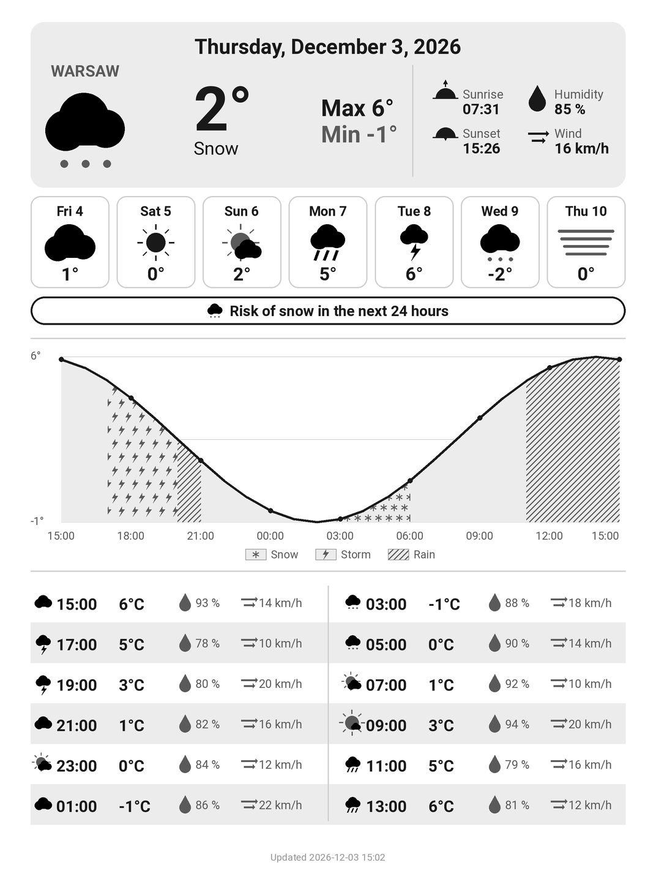

# KindleWeather

[](https://github.com/Marflus/KindleWeather/actions/workflows/ci.yml)

Turn a jailbroken Kindle into a daily weather display. KindleWeather renders a
grayscale dashboard tuned for e-ink from [Open-Meteo](https://open-meteo.com/)
data, installs it on the Kindle as a [KUAL](https://www.mobileread.com/forums/showthread.php?t=203326)
extension, and can refresh it every morning with GitHub Actions.

**[Version française ci-dessous](#français)**

<p align="center"></p>
<p align="center"><sub>Sample output, rendered from test data.</sub></p>

## Features

- Today's conditions, min/max, sunrise and sunset, average humidity and wind
- 24-hour temperature chart with rainy hours hatched, and a 2-hourly table
- English and French interface
- City set by name; coordinates and the displayed, localized city name come from the Open-Meteo geocoding API
- Rendered at 2x then downscaled, for clean anti-aliasing on e-ink
- KUAL button to redisplay the dashboard at any time
- Deployment over SSH (e.g. through Tailscale) or by copying to the Kindle's USB drive

## How it works

```
GitHub Actions, daily (or your computer)       Kindle (jailbroken)
 ├─ kindle-weather render                         /mnt/us/extensions/kindleweather/
 │    Open-Meteo geocoding + forecast            ├─ dashboard.png
 │    -> dashboard.png                           ├─ menu.json, config.xml   KUAL button
 └─ kindle-weather deploy  -- SSH / USB -------->  ├─ bin/show.sh             full e-ink refresh
                                                 ├─ bin/watchdog.sh         cron: wake window
                                                 └─ bin/install.sh          registers the watchdog
```

When the scheduled job runs, the Kindle is normally asleep. The watchdog, run
by the Kindle's own `crond` every 5 minutes, keeps it awake and on Wi-Fi from
05:50 to 06:20 only, so the job can reach it without draining the battery the
rest of the day.

## Compatibility

You need a **jailbroken** Kindle with **KUAL**. Automatic updates additionally
need SSH access (the **USBNetwork** hack) and a network path to the Kindle
(e.g. **Tailscale** running on it). Whether a jailbreak exists depends on your
firmware version: see [Kindle Modding](https://kindlemodding.org/) and the
[MobileRead Kindle Developer's Corner](https://www.mobileread.com/forums/forumdisplay.php?f=150).

| Model | Screen | Status |
|---|---|---|
| Kindle Paperwhite 3 (7th gen, 2015) | 1072×1448 | Tested |
| Kindle Voyage (2014) | 1072×1448 | Same resolution, should work |
| Kindle Oasis (8th gen, 2016) | 1072×1448 | Same resolution, should work |
| Kindle Paperwhite 4 (10th gen, 2018) | 1072×1448 | Same resolution, should work |
| Kindle (11th gen, 2022) | 1072×1448 | Same resolution, should work |
| Kindle Paperwhite 5 (11th gen, 2021) | 1236×1648 | Set `display` in the config, untested |
| Kindle Oasis 2 and 3 (2017, 2019) | 1264×1680 | Set `display` in the config, untested |
| Kindle Paperwhite 1 and 2 (2012, 2013) | 758×1024 | Set `display` in the config, untested |

The layout is designed for 1072×1448. Other resolutions get the same layout
scaled to the configured size.

## Installation

### 1. Prepare the Kindle

1. Jailbreak the Kindle and install KUAL and MRPI (see the links above).
2. For automatic updates, install USBNetwork for SSH access, and add your public
   key to `/mnt/us/usbnet/etc/authorized_keys`. Optionally install Tailscale on
   the Kindle so it can be reached from anywhere, including GitHub Actions.

### 2. Install KindleWeather on your computer

Python 3.10 or newer is required.

```bash
git clone https://github.com/Marflus/KindleWeather.git
cd KindleWeather
pip install .
```

### 3. Configure

Edit [`config/config.json`](config/config.json):

```json
{
  "language": "en",
  "location": { "city": "Lyon", "country_code": "FR" },
  "display": { "width": 1072, "height": 1448 },
  "kindle": {
    "method": "ssh",
    "host": "100.64.0.12",
    "user": "root",
    "ssh_key": "~/.ssh/id_ed25519",
    "mount_path": ""
  }
}
```

| Key | Description |
|---|---|
| `language` | `"en"` or `"fr"`. Applies to the dashboard, the city name and the KUAL menu. |
| `location.city` | City name. It is geocoded by Open-Meteo, and the name shown on the dashboard is fetched in the chosen language. |
| `location.country_code` | Optional ISO 3166-1 alpha-2 code (`"FR"`, `"US"`...) to pick the right city among homonyms. |
| `display.width`, `display.height` | Screen resolution in pixels (see [Compatibility](#compatibility)). |
| `kindle.method` | `"ssh"` to deploy over the network, `"usb"` to copy to the mounted Kindle drive. |
| `kindle.host` | Kindle IP address (Tailscale or local network). Required for `ssh`. |
| `kindle.user` | SSH user, `root` by default. |
| `kindle.ssh_key` | Path to the SSH private key. If empty, your default SSH keys are used. |
| `kindle.mount_path` | Root of the Kindle drive when plugged in over USB, e.g. `"E:/"` on Windows or `"/media/you/Kindle"` on Linux. Required for `usb`. |

### 4. Render and deploy

```bash
kindle-weather render    # fetches the forecast, writes dashboard.png
kindle-weather deploy    # installs the KUAL extension and the dashboard
```

- With `ssh`, `deploy` copies the extension to `/mnt/us/extensions/kindleweather`,
  registers the wake watchdog in the Kindle's crontab, turns the frontlight off
  and displays the dashboard.
- With `usb`, `deploy` copies the extension to the Kindle drive. Eject the
  Kindle, then open **KUAL > KindleWeather** to display it.

The KUAL button **KindleWeather > Show weather dashboard** redisplays the latest
dashboard at any time. KUAL only scans for new extensions when it starts, so
restart the Kindle after the first installation.

## Automatic daily updates with GitHub Actions

The [`Update Kindle`](.github/workflows/update.yml) workflow renders and deploys
the dashboard every morning at 06:00 (Europe/Paris).

1. Fork this repository, edit `config/config.json` and commit it.
2. In **Settings > Secrets and variables > Actions**, add:
   - `TAILSCALE_AUTHKEY`: a reusable [Tailscale auth key](https://tailscale.com/kb/1085/auth-keys) for the runner;
   - `KINDLE_SSH_KEY`: the private key matching the public key installed on the Kindle.
3. Test it from **Actions > Update Kindle > Run workflow**.

To change the time or time zone, edit `TIMEZONE`, `TARGET_TIME` and the two
`cron` lines in `update.yml` (GitHub schedules in UTC, so there is one line for
summer time and one for winter time), then the wake window in
[`kindle/extension/bin/watchdog.sh`](kindle/extension/bin/watchdog.sh).

## Project structure

```
.github/workflows/  ci.yml (lint and tests), update.yml (daily update)
config/             config.json, the only file to edit
docs/               README assets
kindle/extension/   files installed on the Kindle (KUAL extension)
src/kindle_weather/   Python package: config, weather, i18n, rendering, deployment
tests/              pytest suite, runs offline
```

## Development

```bash
pip install -e ".[dev]"
pytest
ruff check . && ruff format --check .
shellcheck --shell=sh --severity=warning kindle/extension/bin/*.sh
```

CI runs these checks on every push and pull request.

## Known limitations

- **Amazon screensaver.** When the Kindle goes to sleep, its default
  screensaver covers the dashboard. Replacing it is not supported yet.
- **`crond` is not started on every firmware.** On the tested Paperwhite 3,
  nothing starts `crond` at boot, so the wake watchdog never runs and the
  Kindle is only reachable if it happens to be awake. `install.sh` prints a
  warning in the deployment log when `crond` is not running.
- **GitHub delays scheduled workflows**, sometimes by several hours. The
  workflow still runs once a day, but the Kindle must be reachable when it
  actually starts. For punctual updates, trigger the workflow from an external
  scheduler through the GitHub API (`workflow_dispatch`).

---

# Français

Transformez une Kindle jailbreakée en écran météo quotidien. KindleWeather génère
un tableau de bord en niveaux de gris, adapté à l'encre électronique, à partir
des données [Open-Meteo](https://open-meteo.com/). Il l'installe sur la Kindle
sous forme d'extension [KUAL](https://www.mobileread.com/forums/showthread.php?t=203326)
et peut le mettre à jour chaque matin avec GitHub Actions.

## Fonctionnalités

- Conditions du jour, minimales et maximales, lever et coucher du soleil, humidité et vent moyens
- Courbe des températures sur 24 heures avec les heures de pluie hachurées, et tableau toutes les 2 heures
- Interface en anglais et en français
- Ville définie par son nom : les coordonnées et le nom affiché, traduit dans la langue choisie, viennent de l'API de géocodage d'Open-Meteo
- Rendu en 2x puis réduit, pour un anticrénelage net sur l'écran e-ink
- Bouton KUAL pour réafficher le tableau de bord à tout moment
- Déploiement par SSH (par exemple via Tailscale) ou par copie sur le disque USB de la Kindle

## Fonctionnement

```
GitHub Actions, chaque jour (ou votre ordinateur)   Kindle (jailbreakée)
 ├─ kindle-weather render                              /mnt/us/extensions/kindleweather/
 │    géocodage + prévisions Open-Meteo               ├─ dashboard.png
 │    -> dashboard.png                                ├─ menu.json, config.xml   bouton KUAL
 └─ kindle-weather deploy  -- SSH / USB ------------->  ├─ bin/show.sh             rafraîchissement complet
                                                      ├─ bin/watchdog.sh         cron : fenêtre de réveil
                                                      └─ bin/install.sh          installe le watchdog
```

Quand la tâche planifiée s'exécute, la Kindle est normalement en veille. Le
watchdog, lancé toutes les 5 minutes par le `crond` de la Kindle, la garde
éveillée et connectée au Wi-Fi uniquement de 05:50 à 06:20. La tâche peut ainsi
la joindre sans vider la batterie le reste de la journée.

## Compatibilité

Il faut une Kindle **jailbreakée** avec **KUAL**. Les mises à jour automatiques
nécessitent en plus un accès SSH (le hack **USBNetwork**) et un moyen de joindre
la Kindle par le réseau (par exemple **Tailscale** installé dessus).
L'existence d'un jailbreak dépend de la version du firmware : voir
[Kindle Modding](https://kindlemodding.org/) et le
[MobileRead Kindle Developer's Corner](https://www.mobileread.com/forums/forumdisplay.php?f=150).

| Modèle | Écran | État |
|---|---|---|
| Kindle Paperwhite 3 (7e génération, 2015) | 1072×1448 | Testé |
| Kindle Voyage (2014) | 1072×1448 | Même résolution, devrait fonctionner |
| Kindle Oasis (8e génération, 2016) | 1072×1448 | Même résolution, devrait fonctionner |
| Kindle Paperwhite 4 (10e génération, 2018) | 1072×1448 | Même résolution, devrait fonctionner |
| Kindle (11e génération, 2022) | 1072×1448 | Même résolution, devrait fonctionner |
| Kindle Paperwhite 5 (11e génération, 2021) | 1236×1648 | Renseigner `display` dans la configuration, non testé |
| Kindle Oasis 2 et 3 (2017, 2019) | 1264×1680 | Renseigner `display` dans la configuration, non testé |
| Kindle Paperwhite 1 et 2 (2012, 2013) | 758×1024 | Renseigner `display` dans la configuration, non testé |

La mise en page est conçue pour 1072×1448. Pour les autres résolutions, elle
est mise à l'échelle de la taille configurée.

## Installation

### 1. Préparer la Kindle

1. Jailbreaker la Kindle et installer KUAL et MRPI (voir les liens ci-dessus).
2. Pour les mises à jour automatiques, installer USBNetwork pour l'accès SSH et
   ajouter votre clé publique dans `/mnt/us/usbnet/etc/authorized_keys`.
   Installer éventuellement Tailscale sur la Kindle pour la joindre depuis
   n'importe où, y compris depuis GitHub Actions.

### 2. Installer KindleWeather sur votre ordinateur

Python 3.10 ou plus récent est requis.

```bash
git clone https://github.com/Marflus/KindleWeather.git
cd KindleWeather
pip install .
```

### 3. Configurer

Modifier [`config/config.json`](config/config.json) :

```json
{
  "language": "fr",
  "location": { "city": "Lyon", "country_code": "FR" },
  "display": { "width": 1072, "height": 1448 },
  "kindle": {
    "method": "ssh",
    "host": "100.64.0.12",
    "user": "root",
    "ssh_key": "~/.ssh/id_ed25519",
    "mount_path": ""
  }
}
```

| Clé | Description |
|---|---|
| `language` | `"en"` ou `"fr"`. S'applique au tableau de bord, au nom de la ville et au menu KUAL. |
| `location.city` | Nom de la ville. Elle est géocodée par Open-Meteo et le nom affiché est récupéré dans la langue choisie. |
| `location.country_code` | Code ISO 3166-1 alpha-2 facultatif (`"FR"`, `"US"`...) pour choisir la bonne ville parmi des homonymes. |
| `display.width`, `display.height` | Résolution de l'écran en pixels (voir [Compatibilité](#compatibilité)). |
| `kindle.method` | `"ssh"` pour déployer par le réseau, `"usb"` pour copier sur le disque de la Kindle branchée. |
| `kindle.host` | Adresse IP de la Kindle (Tailscale ou réseau local). Obligatoire pour `ssh`. |
| `kindle.user` | Utilisateur SSH, `root` par défaut. |
| `kindle.ssh_key` | Chemin de la clé privée SSH. Si vide, vos clés SSH par défaut sont utilisées. |
| `kindle.mount_path` | Racine du disque de la Kindle branchée en USB, par exemple `"E:/"` sous Windows ou `"/media/vous/Kindle"` sous Linux. Obligatoire pour `usb`. |

### 4. Générer et déployer

```bash
kindle-weather render    # récupère les prévisions, écrit dashboard.png
kindle-weather deploy    # installe l'extension KUAL et le tableau de bord
```

- En `ssh`, `deploy` copie l'extension dans `/mnt/us/extensions/kindleweather`,
  inscrit le watchdog de réveil dans la crontab de la Kindle, éteint
  l'éclairage et affiche le tableau de bord.
- En `usb`, `deploy` copie l'extension sur le disque de la Kindle. Éjectez la
  Kindle, puis ouvrez **KUAL > KindleWeather** pour l'afficher.

Le bouton KUAL **KindleWeather > Afficher le dashboard meteo** réaffiche le
dernier tableau de bord à tout moment. KUAL ne détecte les nouvelles extensions
qu'à son démarrage : redémarrez la Kindle après la première installation.

## Mises à jour quotidiennes avec GitHub Actions

Le workflow [`Update Kindle`](.github/workflows/update.yml) génère et déploie le
tableau de bord chaque matin à 06:00 (Europe/Paris).

1. Forker ce dépôt, modifier `config/config.json` et le committer.
2. Dans **Settings > Secrets and variables > Actions**, ajouter :
   - `TAILSCALE_AUTHKEY` : une [clé d'authentification Tailscale](https://tailscale.com/kb/1085/auth-keys) réutilisable pour le runner ;
   - `KINDLE_SSH_KEY` : la clé privée correspondant à la clé publique installée sur la Kindle.
3. Tester depuis **Actions > Update Kindle > Run workflow**.

Pour changer l'heure ou le fuseau horaire, modifier `TIMEZONE`, `TARGET_TIME` et
les deux lignes `cron` de `update.yml` (GitHub planifie en UTC, d'où une ligne
pour l'heure d'été et une pour l'heure d'hiver), puis la fenêtre de réveil dans
[`kindle/extension/bin/watchdog.sh`](kindle/extension/bin/watchdog.sh).

## Structure du projet

```
.github/workflows/  ci.yml (lint et tests), update.yml (mise à jour quotidienne)
config/             config.json, le seul fichier à modifier
docs/               ressources du README
kindle/extension/   fichiers installés sur la Kindle (extension KUAL)
src/kindle_weather/   paquet Python : configuration, météo, traductions, rendu, déploiement
tests/              tests pytest, exécutés hors ligne
```

## Développement

```bash
pip install -e ".[dev]"
pytest
ruff check . && ruff format --check .
shellcheck --shell=sh --severity=warning kindle/extension/bin/*.sh
```

La CI exécute ces vérifications à chaque push et pull request.

## Limitations connues

- **Écran de veille Amazon.** Quand la Kindle se met en veille, son écran de
  veille par défaut recouvre le tableau de bord. Le remplacer n'est pas encore
  pris en charge.
- **`crond` n'est pas lancé sur tous les firmwares.** Sur la Paperwhite 3 de
  test, rien ne démarre `crond` au boot : le watchdog de réveil ne tourne donc
  jamais et la Kindle n'est joignable que si elle est déjà éveillée.
  `install.sh` affiche un avertissement dans le journal de déploiement quand
  `crond` ne tourne pas.
- **GitHub retarde les workflows planifiés**, parfois de plusieurs heures. Le
  workflow s'exécute quand même une fois par jour, mais la Kindle doit être
  joignable au moment où il démarre réellement. Pour des mises à jour
  ponctuelles, déclencher le workflow depuis un planificateur externe via
  l'API GitHub (`workflow_dispatch`).
