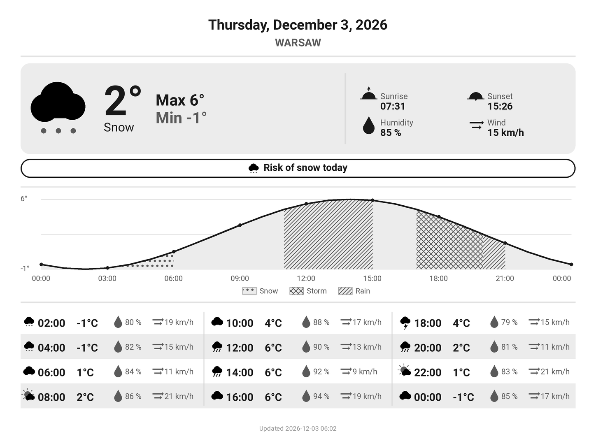

# KindleWeather

[](https://github.com/Marflus/KindleWeather/actions/workflows/ci.yml)

Turn a jailbroken Kindle into a battery-powered weather station. GitHub Actions
renders a grayscale dashboard tuned for e-ink from [Open-Meteo](https://open-meteo.com/)
data every hour. The Kindle downloads it, displays it, and sleeps until the
next refresh.

**[Version française ci-dessous](#français)**

<p align="center">
  
  
</p>
<p align="center"><sub>Portrait and landscape layouts, rendered from sample data.</sub></p>

## Features

- Today's conditions, min/max, sunrise and sunset, average humidity and wind
- Precipitation alert with its icon, by priority: snow, then thunderstorm, then rain
- 24-hour temperature chart marking rain, thunderstorm and snow hours with distinct patterns, and a 2-hourly table
- Portrait or landscape layout, English or French
- City set by name; its coordinates and localized name come from the Open-Meteo geocoding API
- Hourly refresh, with the Kindle suspended to RAM in between

## How it works

```
GitHub Actions, every hour                 Kindle, weather station loop
 kindle-weather render                      1. Wi-Fi on, download dashboard.png
   Open-Meteo -> dashboard.png  -------->   2. Wi-Fi off, display it (eips)
 publish to GitHub Pages                    3. suspend to RAM, wake up 1 hour later
```

The station is a KUAL extension. When started, it stops Amazon's interface and
background services, so nothing covers the dashboard and the battery lasts.
Between refreshes the Kindle is suspended to RAM and woken up by its real-time
clock; the e-ink screen keeps the image without power. To get the normal
Kindle back, restart it. The approach comes from
[kindle-weatherstation](https://github.com/mattzzw/kindle-weatherstation).

## Compatibility

You need a **jailbroken** Kindle with **KUAL** and Wi-Fi. Whether a jailbreak
exists depends on your firmware version: see [Kindle Modding](https://kindlemodding.org/)
and the [MobileRead Kindle Developer's Corner](https://www.mobileread.com/forums/forumdisplay.php?f=150).

| Model | Screen | Notes |
|---|---|---|
| Kindle Paperwhite 3 (7th gen, 2015) | 1072×1448 | Main target |
| Kindle Paperwhite 2 (6th gen, 2013) | 758×1024 | Set `display` in the config |
| Kindle Voyage (2014), Oasis (2016), Paperwhite 4 (2018), Kindle (2022) | 1072×1448 | Same resolution |
| Kindle Paperwhite 5 (2021) | 1236×1648 | Set `display` in the config |
| Kindle Oasis 2 and 3 (2017, 2019) | 1264×1680 | Set `display` in the config |

The layouts are designed for a 1072×1448 screen and scaled to the configured
size. The station expects the wake-up clock at `/dev/rtc1`, as on the
Paperwhite 2 and 3; on other models, check `RTC` in
[`station.sh`](kindle/extension/bin/station.sh).

## Installation

### 1. Publish the dashboard

1. Fork this repository and edit [`config/config.json`](config/config.json)
   (see below). Set `dashboard_url` to your GitHub Pages address:
   `https://<user>.github.io/<repository>/dashboard.png`.
2. In **Settings > Pages**, set **Source** to **GitHub Actions**. GitHub Pages
   requires a public repository on the free plan.
3. Run **Actions > Publish dashboard > Run workflow**, then open `dashboard_url`
   in a browser to check the image. The workflow then runs every hour.

### 2. Install the station on the Kindle

Python 3.10 or newer is required.

```bash
git clone https://github.com/<user>/KindleWeather.git
cd KindleWeather
pip install .
```

Plug the Kindle in over USB, then install the KUAL extension on its drive:

```bash
kindle-weather install E:/                  # Windows
kindle-weather install /media/you/Kindle    # Linux
```

Eject the Kindle and restart it so KUAL picks up the new extension.

### 3. Start the station

Open **KUAL > KindleWeather > Start weather station**. The interface
disappears and the dashboard shows up within a minute. A log is kept in
`extensions/kindleweather/station.log` on the Kindle drive.

To stop the station, hold the power button until the Kindle restarts (10 to
20 seconds).

## Configuration

```json
{
  "language": "en",
  "location": { "city": "Lyon", "country_code": "FR" },
  "display": { "width": 1072, "height": 1448, "orientation": "portrait" },
  "dashboard_url": "https://you.github.io/KindleWeather/dashboard.png"
}
```

| Key | Description |
|---|---|
| `language` | `"en"` or `"fr"`: dashboard, city name and KUAL menu. |
| `location.city` | City name, geocoded by Open-Meteo. The name shown is fetched in the chosen language. |
| `location.country_code` | Optional ISO 3166-1 alpha-2 code (`"FR"`, `"US"`...) to pick the right city among homonyms. |
| `display.width`, `display.height` | Screen resolution in pixels, in portrait (see [Compatibility](#compatibility)). |
| `display.orientation` | `"portrait"` (default) or `"landscape"`. In landscape, read the Kindle turned a quarter turn clockwise. |
| `dashboard_url` | Where the Kindle downloads the dashboard. Any HTTP(S) host works, not only GitHub Pages. |

After changing `language` or `dashboard_url`, run `kindle-weather install`
again. The other settings only need a commit: the next hourly run picks them up.

## Usage

```bash
kindle-weather render [--output dashboard.png]   # render the dashboard locally
kindle-weather install MOUNT_PATH                # install the KUAL extension
```

## Project structure

```
.github/workflows/    ci.yml (lint, tests), publish.yml (hourly dashboard)
config/               config.json, the only file to edit
docs/                 README images
kindle/extension/     KUAL extension; bin/station.sh is the weather station loop
src/kindle_weather/   Python package: config, weather, i18n, graphics, render, install
tests/                pytest suite, runs offline
```

## Development

```bash
pip install -e ".[dev]"
pytest
ruff check . && ruff format --check .
shellcheck --shell=sh --severity=warning kindle/extension/bin/*.sh
```

CI runs these checks on every push and pull request.

## Known limitations

- While the station runs, the Kindle cannot be used as an e-reader.
- GitHub may delay scheduled workflows, so the dashboard can be older than an
  hour. GitHub also disables scheduled workflows after 60 days without
  activity in the repository; re-enable it from the **Actions** tab.
- If the Kindle does not wake up by itself, press the power button: the
  station refreshes, then goes back to sleep. Check `RTC` in `station.sh`
  for your model.

---

# Français

Transformez une Kindle jailbreakée en station météo sur batterie. GitHub
Actions génère chaque heure un tableau de bord en niveaux de gris, adapté à
l'encre électronique, à partir des données [Open-Meteo](https://open-meteo.com/).
La Kindle le télécharge, l'affiche, puis se met en veille jusqu'au
rafraîchissement suivant.

## Fonctionnalités

- Conditions du jour, minimales et maximales, lever et coucher du soleil, humidité et vent moyens
- Alerte de précipitations avec son icône, par priorité : neige, puis orage, puis pluie
- Courbe des températures sur 24 heures, avec un motif différent pour les heures de pluie, d'orage et de neige, et tableau toutes les 2 heures
- Affichage en portrait ou en paysage, en anglais ou en français
- Ville définie par son nom : ses coordonnées et son nom traduit viennent de l'API de géocodage d'Open-Meteo
- Rafraîchissement toutes les heures, avec la Kindle en veille profonde entre deux mises à jour

## Fonctionnement

```
GitHub Actions, toutes les heures          Kindle, boucle de la station
 kindle-weather render                      1. Wi-Fi activé, téléchargement de dashboard.png
   Open-Meteo -> dashboard.png  -------->   2. Wi-Fi coupé, affichage (eips)
 publication sur GitHub Pages               3. veille profonde, réveil 1 heure plus tard
```

La station est une extension KUAL. Au démarrage, elle arrête l'interface
d'Amazon et ses services en arrière-plan : rien ne recouvre plus le tableau de
bord et la batterie tient. Entre deux rafraîchissements, la Kindle est en
veille profonde (suspend to RAM) et se réveille grâce à son horloge interne ;
l'écran e-ink garde l'image sans consommer. Pour retrouver la Kindle normale,
il suffit de la redémarrer. Le principe vient de
[kindle-weatherstation](https://github.com/mattzzw/kindle-weatherstation).

## Compatibilité

Il faut une Kindle **jailbreakée** avec **KUAL** et le Wi-Fi. L'existence d'un
jailbreak dépend de la version du firmware : voir [Kindle Modding](https://kindlemodding.org/)
et le [MobileRead Kindle Developer's Corner](https://www.mobileread.com/forums/forumdisplay.php?f=150).

| Modèle | Écran | Remarques |
|---|---|---|
| Kindle Paperwhite 3 (7e génération, 2015) | 1072×1448 | Cible principale |
| Kindle Paperwhite 2 (6e génération, 2013) | 758×1024 | Renseigner `display` dans la configuration |
| Kindle Voyage (2014), Oasis (2016), Paperwhite 4 (2018), Kindle (2022) | 1072×1448 | Même résolution |
| Kindle Paperwhite 5 (2021) | 1236×1648 | Renseigner `display` dans la configuration |
| Kindle Oasis 2 et 3 (2017, 2019) | 1264×1680 | Renseigner `display` dans la configuration |

Les mises en page sont conçues pour un écran de 1072×1448 et mises à l'échelle
de la taille configurée. La station utilise l'horloge de réveil `/dev/rtc1`,
comme sur les Paperwhite 2 et 3 ; sur les autres modèles, vérifier `RTC` dans
[`station.sh`](kindle/extension/bin/station.sh).

## Installation

### 1. Publier le tableau de bord

1. Forker ce dépôt et modifier [`config/config.json`](config/config.json)
   (voir plus bas). Renseigner dans `dashboard_url` votre adresse GitHub Pages :
   `https://<utilisateur>.github.io/<dépôt>/dashboard.png`.
2. Dans **Settings > Pages**, choisir **GitHub Actions** comme **Source**.
   Avec l'offre gratuite, GitHub Pages exige un dépôt public.
3. Lancer **Actions > Publish dashboard > Run workflow**, puis ouvrir
   `dashboard_url` dans un navigateur pour vérifier l'image. Le workflow
   s'exécute ensuite toutes les heures.

### 2. Installer la station sur la Kindle

Python 3.10 ou plus récent est requis.

```bash
git clone https://github.com/<utilisateur>/KindleWeather.git
cd KindleWeather
pip install .
```

Brancher la Kindle en USB, puis installer l'extension KUAL sur son disque :

```bash
kindle-weather install E:/                    # Windows
kindle-weather install /media/vous/Kindle     # Linux
```

Éjecter la Kindle et la redémarrer pour que KUAL détecte la nouvelle extension.

### 3. Démarrer la station

Ouvrir **KUAL > KindleWeather > Demarrer la station meteo**. L'interface
disparaît et le tableau de bord s'affiche en moins d'une minute. Un journal est
tenu dans `extensions/kindleweather/station.log` sur le disque de la Kindle.

Pour arrêter la station, maintenir le bouton d'alimentation enfoncé jusqu'au
redémarrage de la Kindle (10 à 20 secondes).

## Configuration

```json
{
  "language": "fr",
  "location": { "city": "Lyon", "country_code": "FR" },
  "display": { "width": 1072, "height": 1448, "orientation": "portrait" },
  "dashboard_url": "https://vous.github.io/KindleWeather/dashboard.png"
}
```

| Clé | Description |
|---|---|
| `language` | `"en"` ou `"fr"` : tableau de bord, nom de la ville et menu KUAL. |
| `location.city` | Nom de la ville, géocodée par Open-Meteo. Le nom affiché est récupéré dans la langue choisie. |
| `location.country_code` | Code ISO 3166-1 alpha-2 facultatif (`"FR"`, `"US"`...) pour choisir la bonne ville parmi des homonymes. |
| `display.width`, `display.height` | Résolution de l'écran en pixels, en portrait (voir [Compatibilité](#compatibilité)). |
| `display.orientation` | `"portrait"` (par défaut) ou `"landscape"` (paysage). En paysage, la Kindle se lit tournée d'un quart de tour dans le sens des aiguilles d'une montre. |
| `dashboard_url` | Adresse où la Kindle télécharge le tableau de bord. N'importe quel hébergement HTTP(S) convient, pas seulement GitHub Pages. |

Après un changement de `language` ou de `dashboard_url`, relancer
`kindle-weather install`. Les autres réglages n'ont besoin que d'un commit : le
prochain passage horaire les prend en compte.

## Utilisation

```bash
kindle-weather render [--output dashboard.png]   # générer le tableau de bord en local
kindle-weather install CHEMIN_DU_DISQUE          # installer l'extension KUAL
```

## Structure du projet

```
.github/workflows/    ci.yml (lint, tests), publish.yml (tableau de bord horaire)
config/               config.json, le seul fichier à modifier
docs/                 images du README
kindle/extension/     extension KUAL ; bin/station.sh est la boucle de la station
src/kindle_weather/   paquet Python : configuration, météo, traductions, dessin, rendu, installation
tests/                tests pytest, exécutés hors ligne
```

## Développement

```bash
pip install -e ".[dev]"
pytest
ruff check . && ruff format --check .
shellcheck --shell=sh --severity=warning kindle/extension/bin/*.sh
```

La CI exécute ces vérifications à chaque push et pull request.

## Limitations connues

- Tant que la station tourne, la Kindle ne peut pas servir de liseuse.
- GitHub peut retarder les workflows planifiés : le tableau de bord peut donc
  avoir plus d'une heure. GitHub désactive aussi les workflows planifiés après
  60 jours sans activité sur le dépôt ; les réactiver depuis l'onglet **Actions**.
- Si la Kindle ne se réveille pas toute seule, appuyer sur le bouton
  d'alimentation : la station se met à jour puis se rendort. Vérifier `RTC`
  dans `station.sh` pour votre modèle.
